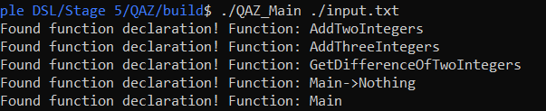

# Creating a simple DSL using DLDL

DLDL is a tool for implementing definitions for Deamer CC.

But DLDL has a lot more to offer.

This tutorial will learn you several things:

- How to use DLDL for starting projects
- How to use DLDL for compiling and running projects, to retrieve languages and other generated tools
- How to define a lexicon in DLDL
- How to define a grammar in DLDL

We won't cover more advanced stuff such as:

- Modifying the C++ CompilerGenerator output of DLDL
- Using DLDL settings file.
- Creating multi-compilers


This tutorial should be sufficient for any beginner.

This tutorial is separated in "stages", each stage has its own directory, and continues after the previous stage. This document lists all stages with information about each stage.

## Prerequisites

You need to have installed the following projects:

- Deamer CC: https://github.com/Deruago/theDeamerProject
- Deamer External: https://github.com/Deruago/DeamerExternal
- DLDL: https://github.com/Deruago/DLDL

To install the projects mentioned, you require CMake. Which can be installed via their site: https://cmake.org/

It is also recommended to download other packages such as bison and flex. As these are the default generators used in Deamer.

## Note for Windows users

Deamer can run on both Linux and Windows.

But in order to use it on **Windows** you require **WSL** to be correctly installed : https://docs.microsoft.com/en-us/windows/wsl/install-win10


# The tutorial

## Stage 0; Creating a "Deamer language project"

A Deamer language project (not referring to Deamer-Project) can be created by using DLDL.

DLDL can initialise the correct directories and some default files to ease development.

If everything is correctly installed run:

```bash
DLDL -init -language-name=QAZ
```

Of course you can use a different name than QAZ, I just choose it as it was the first thing I saw on my QWERTY keyboard. From now on we will refer to the language name by QAZ, as this is the language name we made up.

If everything went correctly you will see the following directories:

- QAZ
- Definition
  - QAZ
    - Lexicon.dldl
    - Lexicon.dldls
    - Grammar.dldl
    - Grammar.dldls
    - Identity.dldl
    - Identity.dldls
    - Generation.dldl
    - Generation.dldls

From now on forget the files with extension ".dldls", and forget the definitions named: "Identity", "Generation". These will become important if you want to use even more from Deamer.

Each file with the extension ".dldl" is called a definition file. DLDL contains several DSL's specialized for understanding definitions. Definitions are a very important part of Deamer, as definitions are the only input Deamer can accept. Everything should be definable.

To define a specific definition, call the file the name of the definition. We can thus assume that the file "Lexicon.dldl" is a lexicon definition.

## Stage 1; Defining the lexicon

Now we have a working root directory, with the directories QAZ and Definition. It is time to define our language.

In Deamer you can define nearly anything using definitions (as long as Deamer has a definition for it), if you want to define something else Deamer doesn't support you can even make your own definitions, but that is for another tutorial.

### Introduction

Different people start in varies ways when it comes to defining a language. For tutorial sake we start with the lexer.

A lexer is in short a program that processes a piece of text, and finds out which tokens can be made in the text. Imagine a piece of code:

```C++
int main()
{
    return 0;
}
```

The lexer can create the following tokens:

- int ; is a Integer token Token
- main ; is a function name Token
- ( ; is a left parenthesis Token
- ) ; is a right parenthesis Token
- { ; is a left bracket Token
- return ; is a Return Token
- 0 ; is a Number Token
- ';' ; is a Semicolon Token
- } ; is a right bracket Token

This process simplifies the work to match text in the parsing stage, dealing with tokens is much simpler than dealing with set of characters.

### QAZ Lexicon

To start defining the lexicon, open the file called "Lexicon.dldl".

```dldl
/ This is a lexicon definition for QAZ

/ Arithmetic
Terminal: EQUAL_EQUAL                  [=][=]
Terminal: EQUAL                        [=]
Terminal: PLUS                         [+]
Terminal: MINUS                        [-]
Terminal: MULTIPLY                     [*]
Terminal: DIVIDE                       [/]

/ Symbols
Terminal: LEFT_PARENTHESIS             [(]
Terminal: RIGHT_PARENTHESIS            [)]
Terminal: LEFT_BRACKET                 [{]
Terminal: RIGHT_BRACKET                [}]
Terminal: LEFT_SQUARE_BRACKET          [\[]
Terminal: RIGHT_SQUARE_BRACKET         [\]]
Terminal: COMMA                        [,]

/ Semicolon
Terminal: SEMICOLON                    [;]

/ Types
Terminal: INTEGER_TYPE                 Integer
Terminal: STRING_TYPE                  String

/ Return
Terminal: RETURN                       Return

/ Declarations
Terminal: FUNCTION                     Define

/ Varnames and Numbers
Terminal: VARNAME                      [a-zA-Z_]+[a-zA-Z_0-9]*
Terminal: DECIMAL                      [0-9]+[\.][0-9]+
Terminal: NUMBER                       [0-9]+

/ Spaces and Escape characters should be deleted
Delete: SPACES                         [ ]*
Delete: ESCAPE_CHARS                   [\n\r\t\v\b\a]*
```

The lexicon above shows the current lexicon.

### Defining a terminal

Note that the structure is as follows:

```
Abstraction: NAME_OF_TERMINAL    [rR]ege[x]*
```

- Abstraction specializes the terminal, different abstractions have different effects on terminals
- NAME_OF_TERMINAL, The name of the specified terminal
- [rR]ege[x]*, basically any regex. You can also use words alongside regexes, spaces are included.

Each token or Terminal symbol can be defined using the abstraction "Terminal:", if you want to you may omit this abstraction as it is the default abstraction to be used.

### How terminals are processed

When a terminal is defined the generated lexer will check if a given subset of text belongs to a given terminal, it does this by the order you have defined this in.

Example the lexer with the following definition:

```DLDL
Terminal: EQEQ [=][=]
Terminal: EQ   [=]
```

and with the following text:

```txt
=
==
===
====
```

The lexer first checks if "=" might be an EQEQ, as it doesn't have a second '=' sign after it, it is not an EQEQ, and proceeds to check if it might be an EQ. As "=" is indeed an EQ it will create an EQ token.

This process continues until the complete text is converted into tokens, or some unknown sequence has occurred. Example of the lexer output for the above text:

```txt
EQ
EQEQ
EQEQ EQ
EQEQ EQEQ
```

### Skipping sequences

It often happens that you want to skip sequences, as often allowing some sequences to be converted to tokens adds overhead to the grammar.

An example being allowing newlines, tabs, spaces, and other escape characters to be converted to tokens. When you allow these character sequences to be used as tokens you need to add a lot more production rules to give every case for when these characters might occur. It is not useful as it doesn't add information, and makes the grammar overly complex.

In this case we want to "delete" or skip these sequences. This means that when we encounter the given sequence (e.g. a newline char) we won't convert it to a token, but "delete" it instead.

To delete a sequence simply use the abstraction "Delete" instead of "Terminal" in front of the declaration.

#### Advised skipped sequences

For beginners that create simple languages it is recommended to put this at the end of their Lexicon definitions:

```DLDL
Delete: ESCAPE_CHARS [\n\r\t\v\b\a ]*
```

This will skip every escape character and space, when no other terminal has required it.

Of course some languages require these characters to be converted to tokens, so feel free to experiment with this.

### Even more abstractions

Abstractions are very powerful, they allow the user to more easily set use cases of specific terminals.

DLDL offers much more abstractions to optimize the final output of a compiler, but we won't cover them in this tutorial.

Examples:

- Novalue or Valueless
- Ignore

## Stage 2; Defining the grammar

### Introduction

The grammar is the part that explains how your language is structured.

We require it as it can be used to do varies things:

- Tell the parser how to read a function declaration
- Tell the parser how to read a variable declaration
- Tell the parser how to correctly read anything

Without a grammar we cannot add structure to the set of tokens we created in the lexer, and we won't understand what the user wanted to convey to us.

The grammar is a context-free grammar. And we will use a modified BNF format in DLDL to define it.

### QAZ Grammar

```DLDL
/ This is the grammar definition for QAZ

/ Start nonterminal to tell the parser where to start
Start: program

/ An program exists of multiple statements
program
	stmts

/ A set of statements is nothing
/ or multiple "stmt" nonterminals
stmts
	stmt stmts
	EMPTY

/ A stmt is either:
/   - Variable declaration
/   - Function declaration
/   - Function call
/   - Assignment
Group: stmt
	declaration
	global_call
	assignment

declaration
	variable_declaration
	FUNCTION function_declaration

global_call
	call SEMICOLON

Group: call
	function_call
	variable_call

function_call
	function_name LEFT_PARENTHESIS function_arguments RIGHT_PARENTHESIS

Group: variable_call
	VARNAME

assignment
	variable_assignment SEMICOLON

expression
	expression MULTIPLY expression
	expression DIVIDE expression
	expression MINUS expression
	expression PLUS expression
	LEFT_PARENTHESIS expression RIGHT_PARENTHESIS
	value
	call
	
variable_declaration
	type variable EQUAL expression SEMICOLON
	
function_declaration
	return_type function_name LEFT_PARENTHESIS function_parameters RIGHT_PARENTHESIS function_block

variable_assignment
	variable EQUAL expression SEMICOLON

return_assignment
	RETURN EQUAL expression SEMICOLON

function_parameters_at_least_one
	function_parameter COMMA function_parameters_at_least_one
	function_parameter

function_parameters
	function_parameters_at_least_one
	EMPTY
	
function_argument_at_least_one	
	function_argument COMMA function_argument_at_least_one
	function_argument
	
function_arguments
	function_argument_at_least_one
	EMPTY

/ A function block is a set of statements, ending with a return assignment
function_block
	LEFT_BRACKET stmts return_assignment RIGHT_BRACKET
	
function_parameter
	type VARNAME

Group: function_argument
	call
	value

Group: function_name
	VARNAME

Group: return_type
	type	

Group: variable
	VARNAME
	
/ You can use integers, strings, or custom defined types.
/ Custom types will later be supported, and require an update in our CFG
Group: type
	INTEGER_TYPE
	STRING_TYPE
	VARNAME

Group: value
	NUMBER
	DECIMAL

/ DLDL files traditionally end with a single SLASH at the end
/ This is optional if you are using DLDL v2 or later
/
```

### Nonterminals and Production rules

An nonterminal is a type which is defined by multiple production rules.

Example:

```dldl
stmts
	stmt stmts
	EMPTY
```

When we come accross the terminal stmts, we need to go through its production rules to find out what it mapped to. In this case a statements is defined by nothing (EMPTY) or multiple stmt (statement).

An CFG is a collection of a lot of nonterminals together, the parser will go through the start nonterminal and will try to map the token sequence from the lexer to a valid route through the nonterminals and production rules defined.

This process gives us an parse tree. Which we can modify to an Abstract Syntax Tree.

### DLDL abstractions

DLDL also offers abstractions for grammars. Abstractions change multiple parts from how the parse tree gets generated, to how the grammar can be described.

#### Start

Start describes which nonterminal should be used to start the parsing stage with. Often it is the first nonterminal, but it is also possible to specify a later occurring nonterminal.

#### Group

Group is used to define whether directly underlying nonterminals or terminals of a given nonterminal, should be a subclass of the nonterminal.

Example:

```DLDL
Group: stmt
	declaration
	global_call
	assignment
```

In the parse tree construction the nonterminals:

- declaration
- global_call
- assignment

Will be a subclass of the common base class "stmt".

This abstraction is very useful for when you want to reuse code in the AST stage or later stages.

#### Other abstractions

Currently DLDL only allows the previous mentioned abstractions, in later versions DLDL might support new abstractions making defining CFG even simpler.

## Stage 3; The compiler generator

### Introduction

Now we have defined the most important parts of our language, but we still don't have a functional language. In this stage we need to compile our definitions to a compiler generator. DLDL will create a project which uses Deamer to generate the compiler we described earlier.

Deamer is an infrastructure for compiler and ecosystem generation. We can use Deamer for compiler generation and also for ecosystem generation (e.g. syntax highlighters).

### Compiling DLDL project to a C++ project using Deamer

Go to the root directory and use the following command:

```bash
DLDL -g
```

This will compile the DLDL definitions to a "compiler generator" project in C++. This project uses Deamer to generate our defined compiler.

The generated project uses CMake for compilation.

### Auto-Compile and Auto-Run

When you have generated the compiler generator project, you can manually compile it and run it, but this process can be automated by DLDL.

DLDL contains an "auto compile", feature that automatically compiles the generated C++ project. Aside from auto compile, it can also automatically run the compiled project. This makes it easier to execute the executable at the right place.

To benefit from this use this for auto compile:

```bash
DLDL -ac
```

And use this to for auto run:

```bash
DLDL -ar
```

### Combining arguments

You can combine multiple arguments, one example is combining the process defined earlier to 1 single command:

```bash
DLDL -g -ac -ar
```

This will automatically generate the C++ project, compile it, and run it at the right spot.

```bash
DLDL -regen
```

The regeneration argument takes in all the passive arguments stored in the .deamer directory, and re-generate the project. It can serve as a simpler alternative to the above argument combinations, when you do not want to be specific.

### What does this project contain?

Now we have our compiler generator and resulting language, we can understand what DLDL did for us.

#### Compiling DLDL definitions into C++ counterparts

When compiling to the C++ project. DLDL will compile the definitions into C++ code which uses the Deamer infrastructure. Take for example the lexicon, we defined it as follows in DLDL:

```DLDL
/ This is a lexicon definition for QAZ

/ Arithmetic
Terminal: EQUAL_EQUAL                  [=][=]
Terminal: EQUAL                        [=]
Terminal: PLUS                         [+]
Terminal: MINUS                        [-]
Terminal: MULTIPLY                     [*]
Terminal: DIVIDE                       [/]

/ Symbols
Terminal: LEFT_PARENTHESIS             [(]
Terminal: RIGHT_PARENTHESIS            [)]
Terminal: LEFT_BRACKET                 [{]
Terminal: RIGHT_BRACKET                [}]
Terminal: LEFT_SQUARE_BRACKET          [\[]
Terminal: RIGHT_SQUARE_BRACKET         [\]]

/ Semicolon
Terminal: SEMICOLON                    [;]

/ Types
Terminal: INTEGER_TYPE                 Integer
Terminal: STRING_TYPE                  String

/ Return
Terminal: RETURN                       Return

/ Varnames and Numbers
Terminal: VARNAME                      [a-zA-Z_]+[a-zA-Z_0-9]+
Terminal: DECIMAL                      [0-9]+[\.][0-9]+
Terminal: NUMBER                       [0-9]+

/ Spaces and Escape characters should be deleted
Delete: SPACES                         [ ]*
Delete: ESCAPE_CHARS                   [\n\r\t\v\b\a]*
```

The counterpart in C++ is as follows:

```C++
#ifndef QAZ_LEXICON_H
#define QAZ_LEXICON_H

#include "Deamer/Language/Generator/Definition/Property/User/Main/Lexicon.h"

namespace QAZ
{
	class Language;
	class Lexicon : public ::deamer::language::generator::definition::property::user::Lexicon<
								::QAZ::Language>
	{
	public:
		// Terminal declarations
		::deamer::type::SafeReserve<::deamer::language::type::definition::object::main::Terminal> EQUAL_EQUAL;
		::deamer::type::SafeReserve<::deamer::language::type::definition::object::main::Terminal> EQUAL;
		::deamer::type::SafeReserve<::deamer::language::type::definition::object::main::Terminal> PLUS;
		::deamer::type::SafeReserve<::deamer::language::type::definition::object::main::Terminal> MINUS;
		::deamer::type::SafeReserve<::deamer::language::type::definition::object::main::Terminal> MULTIPLY;
		::deamer::type::SafeReserve<::deamer::language::type::definition::object::main::Terminal> DIVIDE;
		::deamer::type::SafeReserve<::deamer::language::type::definition::object::main::Terminal> LEFT_PARENTHESIS;
		::deamer::type::SafeReserve<::deamer::language::type::definition::object::main::Terminal> RIGHT_PARENTHESIS;
		::deamer::type::SafeReserve<::deamer::language::type::definition::object::main::Terminal> LEFT_BRACKET;
		::deamer::type::SafeReserve<::deamer::language::type::definition::object::main::Terminal> RIGHT_BRACKET;
		::deamer::type::SafeReserve<::deamer::language::type::definition::object::main::Terminal> LEFT_SQUARE_BRACKET;
		::deamer::type::SafeReserve<::deamer::language::type::definition::object::main::Terminal> RIGHT_SQUARE_BRACKET;
		::deamer::type::SafeReserve<::deamer::language::type::definition::object::main::Terminal> COMMA;
		::deamer::type::SafeReserve<::deamer::language::type::definition::object::main::Terminal> SEMICOLON;
		::deamer::type::SafeReserve<::deamer::language::type::definition::object::main::Terminal> INTEGER_TYPE;
		::deamer::type::SafeReserve<::deamer::language::type::definition::object::main::Terminal> STRING_TYPE;
		::deamer::type::SafeReserve<::deamer::language::type::definition::object::main::Terminal> RETURN;
		::deamer::type::SafeReserve<::deamer::language::type::definition::object::main::Terminal> VARNAME;
		::deamer::type::SafeReserve<::deamer::language::type::definition::object::main::Terminal> DECIMAL;
		::deamer::type::SafeReserve<::deamer::language::type::definition::object::main::Terminal> NUMBER;
		::deamer::type::SafeReserve<::deamer::language::type::definition::object::main::Terminal> SPACES;
		::deamer::type::SafeReserve<::deamer::language::type::definition::object::main::Terminal> ESCAPE_CHARS;

	
	public:
		Lexicon(QAZ::Language* language)
			:	::deamer::language::generator::definition::property::user::Lexicon<
					::QAZ::Language>(language)
		{
		}
		void GenerateObjects() override
		{
			// Terminals
			EQUAL_EQUAL.Set(deamer::language::type::definition::object::main::Terminal("EQUAL_EQUAL", "[=][=]", ::deamer::language::type::definition::object::main::SpecialType::Standard));
			EQUAL.Set(deamer::language::type::definition::object::main::Terminal("EQUAL", "[=]", ::deamer::language::type::definition::object::main::SpecialType::Standard));
			PLUS.Set(deamer::language::type::definition::object::main::Terminal("PLUS", "[+]", ::deamer::language::type::definition::object::main::SpecialType::Standard));
			MINUS.Set(deamer::language::type::definition::object::main::Terminal("MINUS", "[-]", ::deamer::language::type::definition::object::main::SpecialType::Standard));
			MULTIPLY.Set(deamer::language::type::definition::object::main::Terminal("MULTIPLY", "[*]", ::deamer::language::type::definition::object::main::SpecialType::Standard));
			DIVIDE.Set(deamer::language::type::definition::object::main::Terminal("DIVIDE", "[/]", ::deamer::language::type::definition::object::main::SpecialType::Standard));
			LEFT_PARENTHESIS.Set(deamer::language::type::definition::object::main::Terminal("LEFT_PARENTHESIS", "[(]", ::deamer::language::type::definition::object::main::SpecialType::Standard));
			RIGHT_PARENTHESIS.Set(deamer::language::type::definition::object::main::Terminal("RIGHT_PARENTHESIS", "[)]", ::deamer::language::type::definition::object::main::SpecialType::Standard));
			LEFT_BRACKET.Set(deamer::language::type::definition::object::main::Terminal("LEFT_BRACKET", "[{]", ::deamer::language::type::definition::object::main::SpecialType::Standard));
			RIGHT_BRACKET.Set(deamer::language::type::definition::object::main::Terminal("RIGHT_BRACKET", "[}]", ::deamer::language::type::definition::object::main::SpecialType::Standard));
			LEFT_SQUARE_BRACKET.Set(deamer::language::type::definition::object::main::Terminal("LEFT_SQUARE_BRACKET", "[\\[]", ::deamer::language::type::definition::object::main::SpecialType::Standard));
			RIGHT_SQUARE_BRACKET.Set(deamer::language::type::definition::object::main::Terminal("RIGHT_SQUARE_BRACKET", "[\\]]", ::deamer::language::type::definition::object::main::SpecialType::Standard));
			COMMA.Set(deamer::language::type::definition::object::main::Terminal("COMMA", "[,]", ::deamer::language::type::definition::object::main::SpecialType::Standard));
			SEMICOLON.Set(deamer::language::type::definition::object::main::Terminal("SEMICOLON", "[;]", ::deamer::language::type::definition::object::main::SpecialType::Standard));
			INTEGER_TYPE.Set(deamer::language::type::definition::object::main::Terminal("INTEGER_TYPE", "Integer", ::deamer::language::type::definition::object::main::SpecialType::Standard));
			STRING_TYPE.Set(deamer::language::type::definition::object::main::Terminal("STRING_TYPE", "String", ::deamer::language::type::definition::object::main::SpecialType::Standard));
			RETURN.Set(deamer::language::type::definition::object::main::Terminal("RETURN", "Return", ::deamer::language::type::definition::object::main::SpecialType::Standard));
			VARNAME.Set(deamer::language::type::definition::object::main::Terminal("VARNAME", "[a-zA-Z_]+[a-zA-Z_0-9]+", ::deamer::language::type::definition::object::main::SpecialType::Standard));
			DECIMAL.Set(deamer::language::type::definition::object::main::Terminal("DECIMAL", "[0-9]+[\\.][0-9]+", ::deamer::language::type::definition::object::main::SpecialType::Standard));
			NUMBER.Set(deamer::language::type::definition::object::main::Terminal("NUMBER", "[0-9]+", ::deamer::language::type::definition::object::main::SpecialType::Standard));
			SPACES.Set(deamer::language::type::definition::object::main::Terminal("SPACES", "[ ]*", ::deamer::language::type::definition::object::main::SpecialType::Delete));
			ESCAPE_CHARS.Set(deamer::language::type::definition::object::main::Terminal("ESCAPE_CHARS", "[\\n\\r\\t\\v\\b\\a]*", ::deamer::language::type::definition::object::main::SpecialType::Delete));

			// Add object calls
			// AddObject(...)
			AddObject(EQUAL_EQUAL);
			AddObject(EQUAL);
			AddObject(PLUS);
			AddObject(MINUS);
			AddObject(MULTIPLY);
			AddObject(DIVIDE);
			AddObject(LEFT_PARENTHESIS);
			AddObject(RIGHT_PARENTHESIS);
			AddObject(LEFT_BRACKET);
			AddObject(RIGHT_BRACKET);
			AddObject(LEFT_SQUARE_BRACKET);
			AddObject(RIGHT_SQUARE_BRACKET);
			AddObject(COMMA);
			AddObject(SEMICOLON);
			AddObject(INTEGER_TYPE);
			AddObject(STRING_TYPE);
			AddObject(RETURN);
			AddObject(VARNAME);
			AddObject(DECIMAL);
			AddObject(NUMBER);
			AddObject(SPACES);
			AddObject(ESCAPE_CHARS);

			// Place higher level operations here.
			// ReplaceObject(..., ...)
			// DeleteObject(..., ...)
			
		}
	};
}
#endif // QAZ_LEXICON_H
```

The code contains a lot of boilerplate due to the properties of Deamer. As we don't want to debug or write this code, DLDL is created to generate the boilerplate for us.

A question might be: "Why does Deamer have such boilerplate?", it is simple this allows us to keep Deamer:

- simple,
- easily generatable,
- and easily extendable

But of course it comes at the cost of writability. Thus the reason DLDL was created.

It is still nice to learn how these C++ definition counterparts work, as it allows to better understand the process Deamer undergoes to understanding your definitions. In some cases, when DLDL doesn't support the definition you want to use, it is required to understand the C++ counterpart, but there will be tutorials for that.

#### Creating the language class

The language class is an important piece in the compiler generator project. It combines all definitions (called LPD or Language Property Definitions) into a single language definition (LD):

```C++
#ifndef QAZ_LANGUAGE_H
#define QAZ_LANGUAGE_H
#include "Deamer/Language/Generator/Definition/Language.h"
#include "QAZ/Identity.h"
#include "QAZ/Generation.h"
#include "QAZ/Grammar.h"
#include "QAZ/Lexicon.h"

namespace QAZ
{
	/*!	\class Language
	 *
	 *	\brief This contains the Language Definition of the language QAZ
	 *
	 *	\details The LD initializes all base LPD's with its own pointer (this).
	 *	This allows the LPD's to access other LPD's via the language object.
	 *
	 *	\note This is auto-generated via the DLDL definition.
	 */
	class Language : public ::deamer::language::generator::definition::Language<
						 ::QAZ::Language , ::QAZ::Identity
                        , ::QAZ::Generation
                        , ::QAZ::Grammar
                        , ::QAZ::Lexicon
                        >
						 , public ::QAZ::Identity
                        , public ::QAZ::Generation
                        , public ::QAZ::Grammar
                        , public ::QAZ::Lexicon

	{
	public:
		Language() : ::deamer::language::generator::definition::Language<
						 ::QAZ::Language , ::QAZ::Identity
                        , ::QAZ::Generation
                        , ::QAZ::Grammar
                        , ::QAZ::Lexicon
                        >()
		, ::QAZ::Identity::Identity(this)
        , ::QAZ::Generation::Generation(this)
        , ::QAZ::Grammar::Grammar(this)
        , ::QAZ::Lexicon::Lexicon(this)

		{
		}
		~Language() override = default;
	};
}
#endif // QAZ_LANGUAGE_H
```

#### Creating the compiler generator class

This is where we define how to generate stuff:

```C++
#ifndef QAZ_COMPILERGENERATOR_H
#define QAZ_COMPILERGENERATOR_H
#include "Deamer/Compiler/Generator/Compiler.h"
#include "QAZ/Language.h"

#include "Deamer/Ast/Generation/CPP/CPP.h"
#include "Deamer/Lexer/Generator/Flex/Flex.h"
#include "Deamer/Parser/Generator/Bison/Bison.h"

namespace QAZ
{
	/*!	\class CompilerGenerator
	 *
	 *	\brief This contains the CompilerGenerator of the language QAZ
	 *
	 *	\details The CompilerGenerator class generates the compiler and various ecosystems.
	 *
	 *	\note This is auto-generated via the DLDL definitions.
	 */
	class CompilerGenerator : public ::deamer::compiler::generator::Compiler<::QAZ::Language>
	
	{
	public:
		CompilerGenerator()
			: deamer::compiler::generator::Compiler<::QAZ::Language>()
			
		{
		}
		deamer::file::compiler::Output Generate() override
		{
			// Retrieve the Language Definition (LD)
			::deamer::file::compiler::Output output(::deamer::compiler::generator::Compiler<::QAZ::Language>::GetLanguageDefinition());
			
			// Initialize language outputs
			::deamer::ast::generation::cpp::CPP CPP(::deamer::compiler::generator::Compiler<::QAZ::Language>::GetLanguageDefinition());
            ::deamer::lexer::generator::flex::Flex Flex(::deamer::compiler::generator::Compiler<::QAZ::Language>::GetLanguageDefinition());
            ::deamer::parser::generator::bison::Bison Bison(::deamer::compiler::generator::Compiler<::QAZ::Language>::GetLanguageDefinition());

			// The language generation targets
			output.AddLanguageToolOutput(CPP.Generate());
            output.AddLanguageToolOutput(Flex.Generate());
            output.AddLanguageToolOutput(Bison.Generate());

			return output;
		}
		~CompilerGenerator() override = default;
	};
}
#endif // QAZ_COMPILERGENERATOR_H
```

This code creates an output, this output contains all the outputs of each tool that you wanted to generate and each other program that you wanted to use. So we generate the following things and combine them as an output:

- lexer
- parser
- AST
- tools
- sub-languages

You can choose which stuff will be generated and which don't, but changing this will require an update in the Generation LPD. This will get a tutorial later on.

#### Exploring more

When you want to learn more about the LD/LPD system in Deamer, you can do so when the tutorials and documentation are available.

A lot of work has been put in the LD/LPD system to make it incredibly extendable, allowing even you to create new definitions in a few hours. This system is still in development and will be improved in later versions of Deamer.

### More features in DLDL

DLDL is much more than only defining languages, DLDL will become/is able to do the following:

- initialize projects
- compile and run projects
- maintain projects
- improve definitions
- compile definitions
- operate upon definitions
- much more

DLDL is used to generate all boilerplate required to start using Deamer, and for developing Deamer.

## Stage 4; Understanding the output of the Compiler Generator

### Introduction

Now we have generated our compiler generator project using DLDL, and auto-compiled it and auto-runned it. We got our language.

There is a lot to explore in this language that was generated. If you cannot locate your language directory go to the "QAZ" directory found in the root directory of your project.

The "QAZ" directory contains the language project. This project is in C++, uses CMake for compilation, and uses the external library of Deamer. Using the special external library of Deamer the compiler generated can use any license as long as it complies with the terms of the Apache-2.0 license of [Deamer External Library](https://github.com/Deruago/DeamerExternal).

### What did Deamer just do?

Clearly we now have entered the realm of what Deamer did for us. The compiler generator project generated the base of the compiler that is our language.

Deamer given our compiler generator project, generated our language but also:

- The specified tools that we wanted to generate
- The specified programs that we wanted to generate
- Default code to allow easier start
- Default CMake project ready to be expanded upon
- Create the directories: "extern", "include", "lib"

#### Extern, Include, Lib

These directories have different purposes:

- Include: used to contain all main project headers

- Lib: used to contain all main project source files (excluding the main.cpp file)

- Extern: This directory contains subdirectories for each tool/extension/program generated in the compiler generator.

  You will find here the lexer and parser source code, and code for optional tools you have checked.

### Generated lexer

If you used the default settings, Deamer will select "flex" for lexer generation.  The source files can be found in the directory: "Extern/Flex". If you want to interact with it you require the usage of the header file located at: "Include/QAZ/Flex".

The header file is standardized for each underlying lexer generator, so if you change from lexer generator the usage will be the same.

### Generated Parser

If you used the default settings, Deamer will select "bison" for parser generation.  The source files can be found in the directory: "Extern/Bison". If you want to interact with it you require the usage of the header file located at: "Include/QAZ/Bison".

The header file is standardized for each underlying parser generator, so if you change from parser generator the usage will be the same.

### Generated AST

If you have chosen to generate the AST the AST classes can be found at: "include/QAZ/Ast/Node".

In the Ast directory you can find more directories:

- Listener
- Visitor
- Common
- Enum

##### Listener

Listeners are used to walk through Abstract syntax trees automatically, and do something when a given type has been occurred.

This is used when you don't require the benefit of visitors, being that you can modify how to walk the tree.

There are 2 types of listeners:

- Entry-Exit listeners ; Useful for when you want to something on the entry and exit of an nonterminal.
- Listener ; Useful for when you don't require specific logic for entry or exit.

##### Visitor

Visitor are used to manually walk through Abstract syntax trees. You can choose which path to explore further given the current type.

##### Common

This directory contains the classes used as common base class for a set of classes. If you use group to define subtypes, the base type will add a common class to this directory.

##### Enum

Contains enumerations related to the AST-nodes.

##### Node

Contains all AST-nodes known in the language.

#### CMake targets

Deamer adds default targets to the CMake project. These consists of:

- QAZ_static_library; Static library version of your language.
- QAZ_shared_library; Shared library version of your language.
- QAZ_external_libraries; This contains all tool static libraries.
- QAZ\_[tool]\_static_library; For every tool build there is a static library available to use.

Adding an executable for your compiler is as easy as creating a "main.cpp" and linking it with "QAZ_static_library".

### How to use the output

As the project uses CMake for compilation, most IDE's can load in the project very neatly.

## Stage 5; Creating a simple AST listener for our language

### Introduction

Now we generated our language, and understand parts of the output Deamer created for us. We can start making some useful programs using the given listeners. This listener is very simple, but it will show you how to interact with the API properly.

#### Idea

The idea is that we want to count the number of functions in our code. This should show how the most important parts of the API function and how you can use it.

If your DSL doesn't have functions, it is fine to take something else that is in your DSL as example.

#### Creating a custom listener

To start creating a custom listener, it is recommended to add a new class in the "include/ast/listener/user" directory, and derive from the base listener class.

You will get something like this:

```C++
#ifndef QAZ_AST_LISTENER_USER_COUNTFUNCTION_H
#define QAZ_AST_LISTENER_USER_COUNTFUNCTION_H

#include "QAZ/Ast/Listener/Listener.h"

namespace QAZ::ast::listener::user
{
	class CountFunction : public Listener
	{
	private:
	public:
		CountFunction() = default;
		~CountFunction() override = default;
	public:
	};
}

#endif // QAZ_AST_LISTENER_USER_COUNTFUNCTION_H
```

#### Listen to the function declaration

As we want to count the function declaration in the code, we require to listen to all occurrences of the nonterminal "function_declaration".

We can do so by overriding the member function `void Listen(const QAZ::ast::node::function_declaration* node)`:

```c++
#ifndef QAZ_AST_LISTENER_USER_COUNTFUNCTION_H
#define QAZ_AST_LISTENER_USER_COUNTFUNCTION_H

#include "QAZ/Ast/Listener/Listener.h"
#include <iostream>

namespace QAZ::ast::listener::user
{
	class CountFunction : public Listener
	{
	private:
	public:
		CountFunction() = default;
		~CountFunction() override = default;
	public:
		void Listen(const QAZ::ast::node::function_declaration* node) override
		{
            // Get the function name, and then retrieve the VARNAME terminal in the function_name nonterminal.
            const std::string function = node->Get(Type::function_name)[0]->Get(Type::VARNAME)[0]->GetValue();
            
			std::cout << "I found a function declaration!: " << function << "\n";
		}
	};
}

#endif // QAZ_AST_LISTENER_USER_COUNTFUNCTION_H
```

Now we are able to listen to function declarations, and easily list and count all function declarations.

But what did we do? We first listen to each function declaration. After which we call the following function to retrieve the function name:

```C++
const std::string function = node->Get(Type::function_name)[0]->Get(Type::VARNAME)[0]->GetValue();
```

In several steps this is what it does:

- Retrieve the nonterminal "function_name" inside the function_declaration nonterminal
- Retrieve the terminal "VARNAME" inside the function_name nonterminal.
- Retrieve the value of the VARNAME.

It is actually very simple, whenever you are listening for a specific type, you can access the complete tree under or above that type. The function above access the value we wanted from the underlying tree, i.e. we retrieved the function name.

Another way we could have simplified this is by using the following:

```C++
const std::string function = node->GetObject(Type::function_name)->GetChildValue();
```

The function above does the following:

- Get the nonterminal object called: "function_name"
- Get the first child value of the "function_name" nonterminal.

#### Extending the listener

As we also want to correctly show nested function declarations, we need to use a different listener.

We require an EntryExitListener, this listener allows us to do something upon entry and exit of a nonterminal:

```C++
#ifndef QAZ_AST_LISTENER_USER_COUNTFUNCTION_H
#define QAZ_AST_LISTENER_USER_COUNTFUNCTION_H

#include "QAZ/Ast/Listener/EnterExitListener.h"
#include <iostream>
#include <vector>

namespace QAZ::ast::listener::user
{
	class CountFunction : public EnterExitListener
	{
	private:
		std::vector<std::string> current_function_path;
	public:
		CountFunction() = default;
		~CountFunction() override = default;
	public:
		void ListenEntry(const QAZ::ast::node::function_declaration* node) override
		{
			const std::string function = node->GetObject(Type::function_name)->GetChildValue();
			
			current_function_path.push_back(function);
			
		}
		
		void ListenExit(const QAZ::ast::node::function_declaration* node) override
		{
			std::cout << "Found function declaration! Function: ";

			for (int i = 0; i < current_function_path.size(); i++)
			{
				std::cout << current_function_path[i];
				if (i < current_function_path.size() - 1)
				{
					std::cout << "->";
				}
			}

			std::cout << '\n';
			current_function_path.pop_back();
		}
	};
}

#endif // QAZ_AST_LISTENER_USER_COUNTFUNCTION_H
```

The above listener now uses a stack which is managed by the entry and exit of the nonterminals. As nested functions always are exited earlier than the base function, we can use a stack to keep track of the functions. At the exit of an function we can display the appropriate function path.

Note: as we also want to access specific spots in the stack, we used an vector instead and used it as if it was a stack.

#### Execute a listener

We now have a listener, but how can we run the listener? Well the listener requires a start node to be given. An example of how we give this node is shown:

```C++
int main(int argc, char* argv[])
{
	if (argc <= 1)
	{
		std::cout << "Not enough parameters!" << std::endl;
		return -1;
	}
	
	const std::string file = argv[1];
	const std::string text = ReadInFile("./" + file);

	const QAZ::parser::Parser parser;
	auto* AST = parser.Parse(text);

	if (AST == nullptr || AST->GetStartNode() == nullptr)
	{
		std::cout << "Given incorrect text!" << std::endl;
		return -1;
	}

	QAZ::ast::listener::user::CountFunction countFunction;
	countFunction.Dispatch(AST->GetStartNode());

	delete AST;
}
```

#### Running our application using the new listener

Given the text:

```txt
Integer var = 100 * 12;
Integer var2 = var * var;

Define Integer AddTwoIntegers(Integer a, Integer b)
{
	Return = a + b;
}

Define Integer AddThreeIntegers(Integer a, Integer b, Integer c)
{
	Return = a + b + c;
}

Define Integer GetDifferenceOfTwoIntegers(Integer a, Integer b)
{
	Return = a - b;
}

Define Void Main()
{
	Define Void Nothing() { Return = 0; }	

	std_print(GetDifferenceOfTwoIntegers(10, 20));

	Return = 0;
}
```

Running the listener with the AST generated from the parser, prints the following:



As you can see the listener correctly retrieved the various function declarations, and correctly shows nested function declarations.

# End of the tutorial!

Congrats, you finished the tutorial!

If you find something unclear or want more information, you can do so by creating an issue at the repo. This way we know what needs to be improved.

This tutorial will be improved as time goes by.